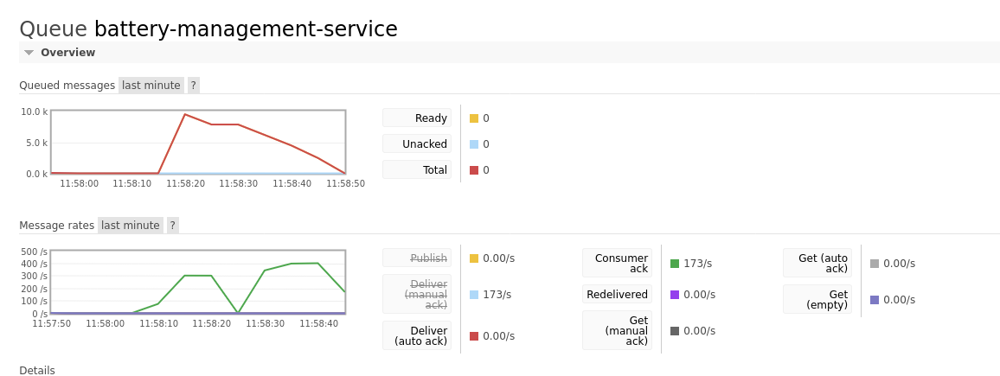

# Database Read/Write Test
- This was a little test creating a pair of microservices that write to a database.
  - The Requester microservice spams several messages onto the message queue `battery-management-service`
  - The Processor microservice reads in those messages and processes the request (e.g. creates a new battery in the db)
- A very simple little test, using SQLite3 and Write-Ahead Logging to improve performance.

- Able to achieve ~500 requests per second with WAL enabled.
