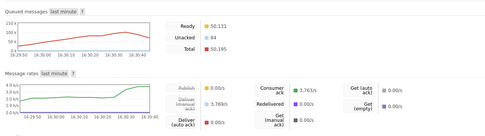

# Pika and PostgreSQL
- The Postgres component of this experiment is sourced from [this video](https://www.youtube.com/watch?v=nlk0QlPdbcY)
- The Pika component is integrated from [1_Pubsub](../1_Pubsub)
- This experiment intends to combine the Pika Microservice template we have been developing with Postgres.

## App
- The app provides a basic example of how to pse psycopg2 and postgres with docker.

## Processor
- The second generation of [5_Databases/processor] which (hopefully) successfully combines Pika, Docker and Postgres the behaviour is intended to be identical to that of the processor in 5_Databases.
- Using some optimisations, I was able to get the speed of the microservice to perform 1,333 write operations per second.
- Enabling write-ahead logging improved the performance slightly - you can enable this by editing the config in docker-compose
  ```yaml
  command:
    - "postgres"
    - "-c"
    - "wal_level=logical"
  ```
- A greater performance gain was achieved by enabling asynchronous commits
  ```yaml
  command:
    - "postgres"
    - "-c"
    - "wal_level=logical"
    - "-c"
    - "synchronous_commit=off"
  ```


By scaling up the number of instances of each service (processor=64, generator=2), we can achieve even greater performance

