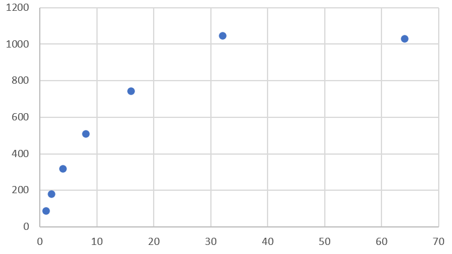

# Microservice vs Monolithic Architecture Comparison

This test aims to validate the hypothesis that whilst a microservice architecture with low replica counts will probably
be outperformed by a Monolithic architecture, with higher replica counts will significantly outperform a Monolithic
architecture.

This test simulates a load of inserting a battery record into a Postgresql database.

## Run Tests

To run the tests, there are a few commands to be aware of.

1. Run the Microservice or Monolithic projects

```bash
# Run the Microservice project with n=2 replicas of the battery management service

cd Microservice
docker compose down -v # Clear the stack, and remove all attached volumes
docker compose up --scale batterymanagement=2 --build

# Run the Monolithic project

cd Monolithic
docker compose down -v
docker compose up --build
```

2. Run the k6s tests

```bash
k6s run loadtest.js # Run in the root directory of the project.
```

## Results
Performing these tests for the Monolithic architecture and the Microservice architecture (n=[1,2,4,8,16,32]) for 3 trials each yields the following results.



## Testing Procedure
> The following testing procedure was used to generate the results shown above, repeated for each variant.

- The test API Gateway in both cases was constructed using Python-Flask and run using Gunicorn.
- The PostgreSQL and RabbitMQ servers were run using Docker.

1. Run `docker compose down -v` to tear down the previous test instance
2. Run `docker compose up` to start the test instance (or `docker compose up --scale batterymanagement=n` for the Microservice architecture), where n is the number of microservice instances to construct
3. Check Adminer (`localhost:8080`) to ensure that the old database table has been torn down and reconstructed
4. Check RabbitMQ to ensure that the queue is empty.
5. Wait until RabbitMQ shows (n+4) clients connected (that is, wait for the microservice instances to start up).
6. Run `k6s run loadtest.js` to run the load test
7. When k6s reports t=30, run a query on Adminer to extract the number of database records written.